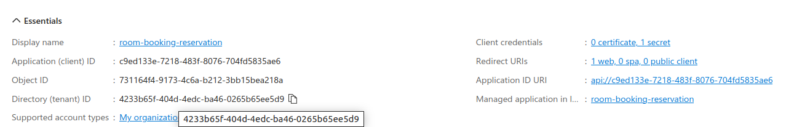
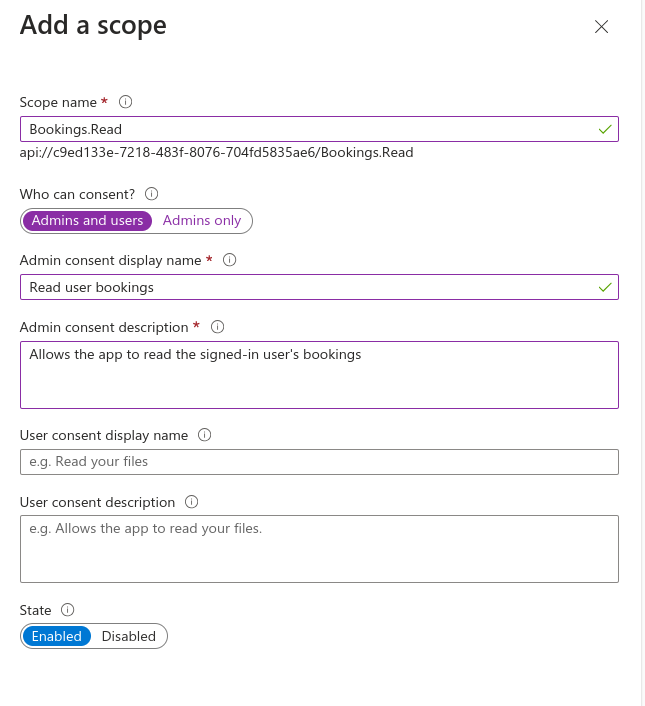
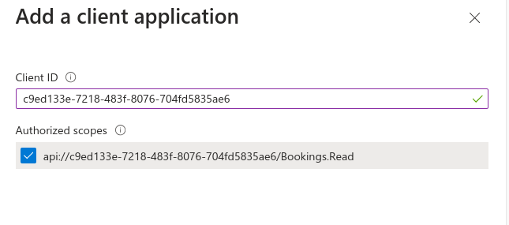
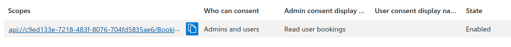
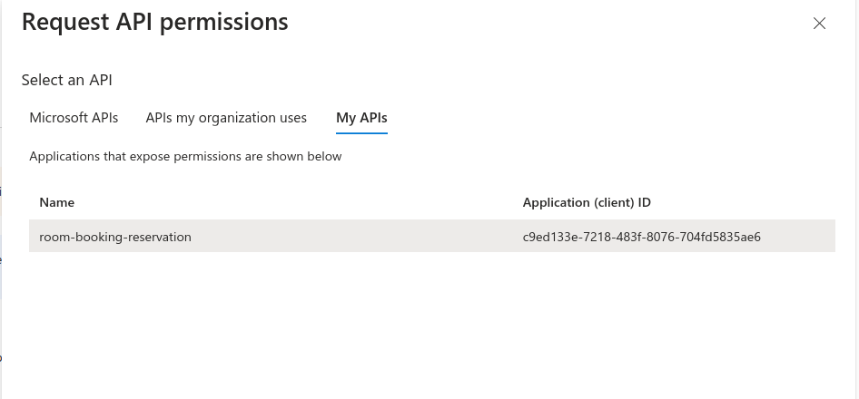
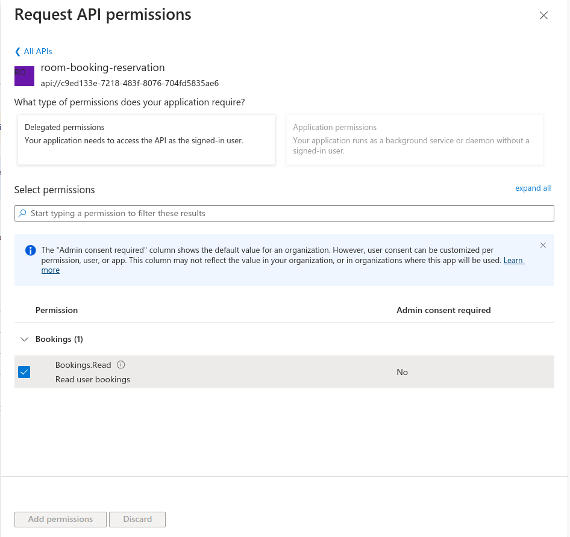
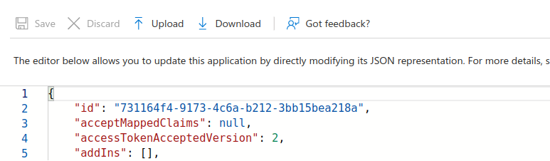

# Create Azure AD

## Introduction

The HRM Authentication API is used OAuth2, and OpenID Protocol do to authentication with Azure Active Directory. It needs a few information to complete setup including:

- Client ID
- Client Secret
- Tenant ID
- Redirect URL (Callback URL)
- Scopes

To get started with Azure AD for configure authentication with OAuth2, and OpenID. You need visit and login to https://portal.azure.com, and open `App registrations` for next steps.

## Get Started

### Create new app

- Select `New registration` to create new app.
- Fill all required information.
- **Important**: You need to fill the Redirect URI to whitelist the callback URI `/auth/callback`. For example: `http://localhost:8080/auth/callback` | `https://hrm-api.techvify.dev/auth/callback`.
- Click `register` when you filled up all information.
- Get back to `App registration` page and move to the next steps.

### Create Credentials & Secrets

- Open `Certificates & secrets`.
- Select `Client secrets`, and click `New client secret`.
- To ensure security, you need to select a specific expiration time of this client secret to allow you rotate the secret. Recommended is 6 months. After 6 months from the secret has been generated, you need to generate a new one and update it for your application.
- Save the values are display. You need it for `Client Secret` variable.

### Create Scopes, and Expose API

- Open `Overview`, and copy value of `Application (client) ID` for `Client ID` variable.
- You also need to copy `Directory (tenant) ID` for `Tenant ID`.
  
- Open `Expose an API`
- In `Application ID URI`, you click `Set` to generate new ID.
- Click `Add a scope`, and fill information same as example below.
  
- Click `Add a client application`. Enter the Client ID, and select scope just was created.
  .
- You need to copy the `URI` in `Scopes` for `Scopes` variable.
  

### Create API Permissions

- Open `API permissions`.
- Click `Add a permission`
- Select `My APIs` and choose the application which is created the scopes.
  
- Select the scopes, and save it.
  

### Upgrade version to V2

- This application is requires to use the v2 of Azure AD.
- Open `Manifest`
- Find `accessTokenAcceptedVersion`, and change the value from `null` to `2`.
- And save it.
  

### Debug the JWT Token

- When you complete login with `/auth/login` and get access token, you can visit to `jwt.ms` to decode your JWT token to verify the version of Azure AD API.
